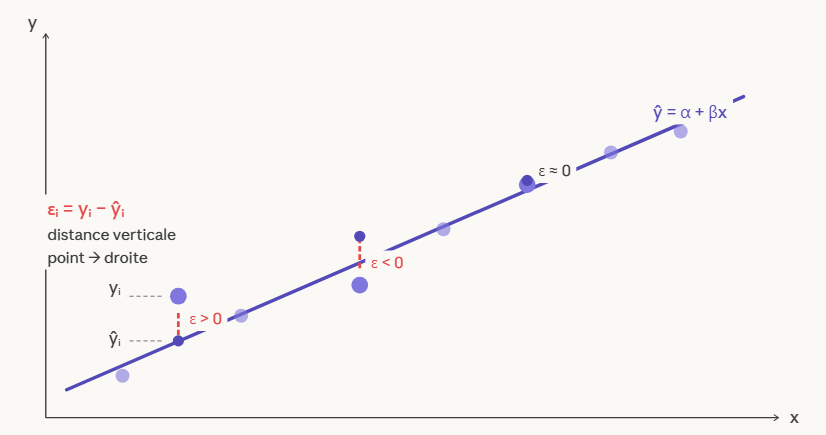
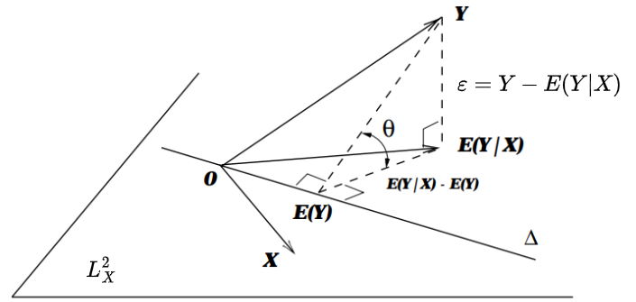
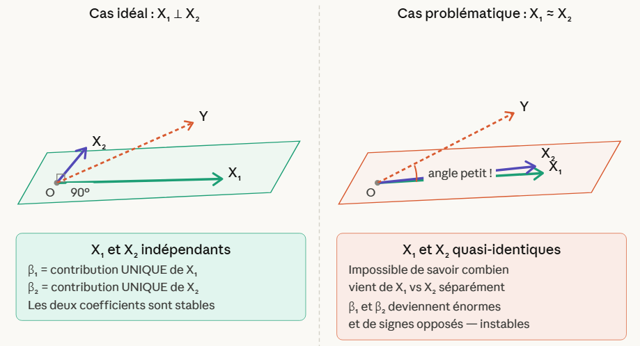
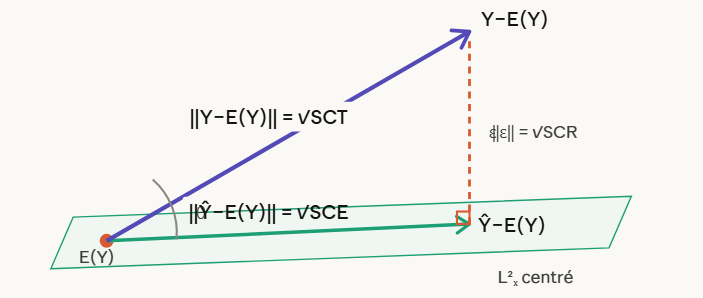

# Régression linéaire

## 1. Le modèle

### (i) Vue classique

On observe $n$ couples $(x_i, y_i)$. On suppose que $Y$ est une fonction linéaire de $X$ plus un bruit :

$$y_i = \alpha + \beta x_i + \varepsilon_i$$

Les $\varepsilon_i$ sont les **résidus** — tout ce que le modèle ne capture pas. Géométriquement, chaque résidu est la distance verticale entre le point observé $y_i$ et la valeur prédite $\hat{y}_i = \alpha + \beta x_i$.

*Figure 1. Vue classique de la régression linéaire simple. Chaque résidu $\varepsilon_i$ est la distance verticale entre le point observé $y_i$ et la valeur prédite $\hat{y}_i = \alpha + \beta x_i$.*

### (ii) Vue géométrique dans $L^2$

On travaille dans $L^2$, muni du produit scalaire $\langle X, Y \rangle = E(XY)$. Dans cet espace, **les vecteurs sont des variables aléatoires**.

L'idée centrale est que $E(Y|X)$ est la **projection orthogonale** de $Y$ sur le sous-espace $L^2_X$ des fonctions de $X$. Cela donne une décomposition naturelle de $Y$ en deux parties orthogonales :

$$Y = E(Y|X) + \varepsilon$$

Le résidu $\varepsilon = Y - E(Y|X)$ est **orthogonal à $L^2_X$**, ce qui signifie $E[\varepsilon \cdot f(X)] = 0$ pour toute fonction $f$. Deux conséquences immédiates :

- $E(\varepsilon) = 0$ — en prenant $f = 1$
- $\text{cov}(\varepsilon, X) = 0$ — en prenant $f = X$

Ces propriétés ne sont pas des hypothèses qu'on impose : elles **découlent directement de la géométrie**.

Quand on restreint $E(Y|X)$ aux fonctions **linéaires**, on obtient : $E(Y|X) = \alpha + \beta X$.

*Figure 2. Interprétation géométrique dans $L^2$. $E(Y|X)$ est la projection orthogonale de $Y$ sur $L^2_X$. Le résidu $\varepsilon = Y - E(Y|X)$ est orthogonal à tout le sous-espace $L^2_X$.*

### (iii) Vue probabiliste

*À venir.*

### (iv) Dérivation des estimateurs MCO (Moindres Carrés Ordinaires)

Le résidu $\varepsilon = Y - \alpha - \beta X$ doit être orthogonal au sous-espace linéaire engendré par $1$ et $X$. MCO (Moindres Carrés Ordinaires, ou OLS en anglais) est la méthode qui trouve $\hat{\alpha}$ et $\hat{\beta}$ en minimisant $\sum(y_i - \hat{y}_i)^2$ — ce qui revient exactement à cette condition d'orthogonalité. On obtient directement :

$$\boxed{\alpha = E(Y) - \beta E(X)} \qquad \boxed{\beta = \frac{\text{cov}(X,Y)}{V(X)}}$$

La droite passe toujours par le point $\big(E(X), E(Y)\big)$ — $\alpha$ n'est qu'un ajustement de position. $\beta$ mesure combien de la variation de $X$ se transfère à $Y$.

Preuve — dérivation par orthogonalité

**Condition 1 :** $\langle \varepsilon, 1 \rangle = 0$

$$E(Y - \alpha - \beta X) = 0 \implies \alpha = E(Y) - \beta E(X)$$

**Condition 2 :** $\langle \varepsilon, X \rangle = 0$

$$E\big[(Y - \alpha - \beta X)X\big] = 0 \implies E(YX) - \alpha E(X) - \beta E(X^2) = 0$$

On substitue $\alpha = E(Y) - \beta E(X)$ :

$$E(YX) - E(Y)E(X) = \beta\big(E(X^2) - E(X)^2\big)$$

Or $E(XY) - E(X)E(Y) = \text{cov}(X,Y)$ et $E(X^2) - E(X)^2 = V(X)$, donc :

$$\beta = \frac{\text{cov}(X,Y)}{V(X)}$$

### (v) Interprétation des coefficients

$\beta$ se lit ainsi : **si $X$ augmente d'une unité, $Y$ augmente en moyenne de $\beta$ unités**, toutes choses égales par ailleurs.

En régression multiple, cette dernière précision est cruciale. Si le modèle est $Y = \beta_0 + \beta_1 X_1 + \beta_2 X_2 + \varepsilon$, alors $\beta_1$ mesure l'effet *pur* de $X_1$ sur $Y$, **une fois l'effet de $X_2$ retiré**. C'est la conséquence directe de la géométrie : MCO projette $Y$ sur le sous-espace engendré par $X_1$ et $X_2$ conjointement. Si $X_1$ et $X_2$ sont orthogonaux dans $L^2$ — c'est-à-dire $\text{cov}(X_1, X_2) = 0$ — alors $\beta_1$ et $\beta_2$ sont exactement les coefficients qu'on obtiendrait en régressant $Y$ sur chacun séparément. L'orthogonalité annule toute interférence entre les variables.

Dans le cas particulier où $(Y, X_1, \ldots, X_p)$ suit une **loi normale multivariée**, les coefficients $\beta_j$ ont une interprétation probabiliste précise. On peut montrer que :

$$\beta_j = \rho_{Y X_j | X_{-j}} \cdot \frac{\sigma_Y}{\sigma_{X_j}}$$

où $\rho_{Y X_j | X_{-j}}$ est la **corrélation partielle** entre $Y$ et $X_j$ conditionnellement à tous les autres prédicteurs $X_{-j}$. La corrélation partielle mesure exactement ce qui reste de la relation entre $Y$ et $X_j$ une fois qu'on a retiré l'effet linéaire de toutes les autres variables. C'est le fondement probabiliste de l'interprétation *ceteris paribus* — $\beta_j$ ne capture que la relation directe entre $Y$ et $X_j$, purgée de toute interférence.

---

## 2. Diagnostic

On généralise ici au cas de la **régression linéaire multiple** : on observe $n$ couples $(x_i, y_i)$ avec $x_i \in \mathbb{R}^p$, et le modèle devient :

$$y_i = \beta_0 + \beta_1 x_{i1} + \cdots + \beta_p x_{ip} + \varepsilon_i$$

La régression simple est le cas particulier $p = 1$. Tout ce qui suit s'applique aux deux.

### (i) Les hypothèses de Gauss-Markov

Pour que MCO soit un "bon" estimateur, on a besoin de cinq hypothèses sur les résidus $\varepsilon_i$ :

- **H1 — Linéarité.** La relation entre $Y$ et les $X_j$ est bien linéaire.
- **H2 — Exogénéité.** $E(\varepsilon_i | X) = 0$ — les résidus ne sont pas corrélés avec les prédicteurs.
- **H3 — Homoscédasticité.** $V(\varepsilon_i) = \sigma^2$ — tous les résidus ont la même variance.
- **H4 — Indépendance.** Les $\varepsilon_i$ sont indépendants entre eux — pas d'autocorrélation.
- **H5 — Absence de multicolinéarité parfaite.** Les colonnes de $X$ ne sont pas combinaisons linéaires les unes des autres.

### (ii) BLUE — ce que ça veut dire

Sous H1–H5, le théorème de Gauss-Markov dit que l'estimateur MCO est **BLUE** : *Best Linear Unbiased Estimator*.

Ça veut dire trois choses :

- **Linéaire** — $\hat{\beta}$ est une fonction linéaire des observations $y_i$
- **Non biaisé** — $E[\hat{\beta}] = \beta$, i.e. $\text{bias}(\hat{\beta}) = E[\hat{\beta}] - \beta = 0$
- **Best** — parmi tous les estimateurs linéaires non biaisés, MCO a la **variance minimale** : $V(\hat{\beta}) = E\big[(\hat{\beta} - E[\hat{\beta}])^2\big]$ est la plus petite possible

L'intuition : on ne peut pas faire mieux que MCO sans soit introduire du biais, soit sortir de la classe des estimateurs linéaires.

### (iii) Multicolinéarité

**Le problème.** Si une colonne de $X$ est combinaison linéaire des autres — par exemple $X_3 = X_1 + X_2$ — alors $X^\top X$ n'est pas inversible et la formule MCO ne marche plus. C'est la **multicolinéarité parfaite**.

Même sans être parfaite, la multicolinéarité cause des problèmes. Si $X_1$ et $X_2$ pointent presque dans la même direction dans $L^2$, projeter $Y$ dessus devient ambigu — une infinité de combinaisons $(\beta_1, \beta_2)$ donnent à peu près la même projection. **Le modèle sait prédire, mais il ne sait plus comment répartir les coefficients.** Conséquence : les variances de $\hat{\beta}_1$ et $\hat{\beta}_2$ explosent.

**Diagnostic — le VIF.** Le *Variance Inflation Factor* mesure à quel point la variance de $\hat{\beta}_j$ est gonflée par la colinéarité :

$$\text{VIF}_j = \frac{1}{1 - R^2_j}$$

où $R^2_j$ est le $R^2$ de la régression de $X_j$ sur tous les autres prédicteurs. Si $X_j$ est parfaitement expliqué par les autres, $R^2_j \to 1$ et $\text{VIF}_j \to \infty$. Un $\text{VIF}_j > 10$ est un signal d'alarme.

**Remèdes.** Ridge et Lasso introduisent une pénalité qui stabilise les coefficients au prix d'un léger biais — c'est le compromis biais-variance. On en parlera dans un chapitre dédié.

*Figure 3. Multicolinéarité : quand $X_1$ et $X_2$ pointent dans la même direction, projeter $Y$ dessus devient ambigu — les coefficients $\beta_1$ et $\beta_2$ ne sont plus identifiables.*

---

## 3. Inférence & Tests

### (i) Distribution de $\hat{\beta}$

On ajoute une hypothèse aux cinq de Gauss-Markov : les erreurs sont gaussiennes, $\varepsilon_i \sim \mathcal{N}(0, \sigma^2)$. Alors $\hat{\beta}$ est une combinaison linéaire de variables gaussiennes, donc lui-même gaussien :

$$\hat{\beta} \sim \mathcal{N}\!\left(\beta,\ \frac{\sigma^2}{S_{XX}}\right)$$

où $S_{XX} = \sum(x_i - \bar{x})^2$ est la dispersion empirique de $X$.

Rappel — biais et variance d'un estimateur

Le **biais** d'un estimateur $\hat{\theta}$ est l'écart entre son espérance et la vraie valeur :

$$\text{bias}(\hat{\theta}) = E[\hat{\theta}] - \theta$$

La **variance** d'un estimateur mesure sa dispersion autour de son espérance :

$$V(\hat{\theta}) = E\big[(\hat{\theta} - E[\hat{\theta}])^2\big]$$

Trois choses à lire dans $\hat{\beta} \sim \mathcal{N}(\beta,\ \sigma^2/S_{XX})$ :

- **Centré sur $\beta$**, i.e. $E[\hat{\beta}] = \beta$, donc $\text{bias}(\hat{\beta}) = 0$ — $\hat{\beta}$ est sans biais
- **Variance $= \sigma^2/S_{XX}$**, i.e. $V(\hat{\beta}) = \sigma^2/S_{XX}$ — plus $X$ est dispersé, plus $\hat{\beta}$ est précis
- **Variance $\to 0$ quand $n \to \infty$** — $\hat{\beta}$ est convergent

### (ii) Le $R^2$

On centre tout en retirant $E(Y)$. La décomposition $Y = \hat{Y} + \varepsilon$ donne dans $L^2$, par Pythagore :

$$\underbrace{\|Y - E(Y)\|^2}_{\text{SCT}} = \underbrace{\|\hat{Y} - E(Y)\|^2}_{\text{SCE}} + \underbrace{\|\varepsilon\|^2}_{\text{SCR}}$$

où SCT = Somme des Carrés Totale, SCE = Somme des Carrés Expliquée, SCR = Somme des Carrés Résiduelle.

Le $R^2$ est la part de variance expliquée par le modèle :

$$R^2 = \frac{\text{SCE}}{\text{SCT}} = \frac{\|\hat{Y} - E(Y)\|^2}{\|Y - E(Y)\|^2} = \cos^2\theta$$

où $\theta$ est l'angle entre $Y - E(Y)$ et le sous-espace $L^2_X$. Géométriquement : $R^2 = 1$ signifie que $Y$ est dans $L^2_X$ ($\varepsilon = 0$), $R^2 = 0$ signifie que $Y \perp L^2_X$ ($X$ n'explique rien).

*Figure 4. Pythagore dans $L^2$ centré. La décomposition $SCT = SCE + SCR$ est le théorème de Pythagore appliqué au triangle $E(Y)$, $\hat{Y}$, $Y$. $R^2 = \cos^2\theta$.*

**Ce que $R^2$ ne dit pas — les 3 pièges :**

- **$R^2$ élevé $\neq$ bon modèle** — ajouter n'importe quelle variable gonfle $R^2$ mécaniquement, car un espace plus grand capture toujours mieux $Y$. Le $R^2$ ajusté pénalise cet agrandissement.
- **$R^2$ élevé $\neq$ causalité** — $X$ et $Y$ peuvent être corrélés sans lien causal.
- **$R^2$ faible $\neq$ inutile** — en économie, $R^2 = 0.3$ peut être excellent selon le domaine.

**$R^2$ ajusté.** Ajouter une variable au modèle agrandit mécaniquement le sous-espace $L^2_X$ — un espace plus grand capture toujours un peu mieux $Y$, même si la variable ajoutée est du bruit pur. Le $R^2$ augmente donc toujours quand on ajoute un prédicteur, même inutile. Le $R^2$ ajusté corrige ça en pénalisant le nombre de paramètres :

$$\bar{R}^2 = 1 - \frac{n-1}{n-p-1}(1 - R^2)$$

où $p$ est le nombre de prédicteurs. Si une variable n'apporte rien, la pénalité l'emporte et $\bar{R}^2$ diminue.

> 📌 *À compléter : lien géométrique avec l'agrandissement du sous-espace $L^2_X$*

### (iii) Test de Student sur $\hat{\beta}$

**La question.** Est-ce que $X$ a vraiment un effet sur $Y$, ou est-ce que $\hat{\beta} \neq 0$ par chance ?

On teste $H_0 : \beta = 0$ contre $H_1 : \beta \neq 0$.

**La statistique.** $\sigma^2$ est inconnue en pratique, on l'estime par $\hat{\sigma}^2 = \text{SCR}/(n-2)$. On pose :

$$t = \frac{\hat{\beta}}{\hat{\sigma}/\sqrt{S_{XX}}}$$

Sous $H_0$, $t$ suit une loi de Student à $n-2$ degrés de liberté. Pour $n$ grand, on retient la règle :

$$|t| > 1.96 \implies \text{on rejette } H_0 \text{ au seuil } 5\%$$

**La p-value.** C'est la probabilité d'observer un $|t|$ aussi grand si $H_0$ était vraie. Plus elle est petite, plus on est confiant que $\beta \neq 0$. Seuil classique : $p < 0.05$.

**Intervalle de confiance sur $\beta$.** À 95% :

$$\hat{\beta} \pm 1.96 \cdot \frac{\hat{\sigma}}{\sqrt{S_{XX}}}$$

L'intuition : c'est l'ensemble des valeurs de $\beta$ qu'on ne rejetterait pas au seuil 5%. Plus $S_{XX}$ est grand ($X$ dispersé), plus l'intervalle est étroit — plus on est précis.

---

## 4. Prédiction

On dispose d'un modèle estimé $\hat{y} = \hat{\alpha} + \hat{\beta}x$. Pour une nouvelle valeur $x^*$, on veut quantifier l'incertitude autour de la prédiction $\hat{y}^* = \hat{\alpha} + \hat{\beta}x^*$.

Il y a deux questions très différentes qu'on peut poser :

- **Où se situe la moyenne de $Y$ en $x^*$ ?** → Intervalle de confiance
- **Où va tomber une nouvelle observation individuelle en $x^*$ ?** → Intervalle de prédiction

### (i) Intervalle de confiance sur $E(Y|X=x^*)$

On cherche à encadrer la vraie moyenne $E(Y|X=x^*) = \alpha + \beta x^*$. L'incertitude vient uniquement de l'estimation de $\hat{\alpha}$ et $\hat{\beta}$. À 95% :

$$\hat{y}^* \pm 1.96 \cdot \hat{\sigma}\sqrt{\frac{1}{n} + \frac{(x^* - \bar{x})^2}{S_{XX}}}$$

### (ii) Intervalle de prédiction sur $Y(x^*)$

On cherche à encadrer une nouvelle observation individuelle $y^* = \alpha + \beta x^* + \varepsilon^*$. L'incertitude vient de deux sources : l'estimation de $\hat{\alpha}$ et $\hat{\beta}$ **plus** le bruit irréductible $\varepsilon^*$. À 95% :

$$\hat{y}^* \pm 1.96 \cdot \hat{\sigma}\sqrt{1 + \frac{1}{n} + \frac{(x^* - \bar{x})^2}{S_{XX}}}$$

### (iii) Pourquoi IP est toujours plus large que IC

La seule différence entre les deux formules est le $+1$ sous la racine dans l'IP. Ce $1$ représente la variance du bruit $\varepsilon^*$ — irréductible peu importe la taille de l'échantillon. Même avec $n \to \infty$, on estimerait $\alpha + \beta x^*$ parfaitement, mais une observation individuelle resterait dispersée autour de cette moyenne. **On ne peut pas prédire le bruit.**

Les deux intervalles s'élargissent aussi quand $x^*$ s'éloigne de $\bar{x}$ — on extrapole loin des données, l'estimation devient moins fiable.
