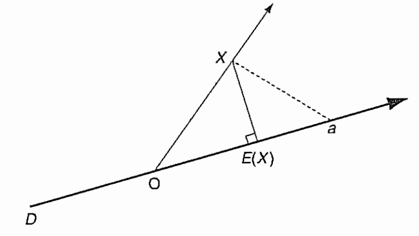
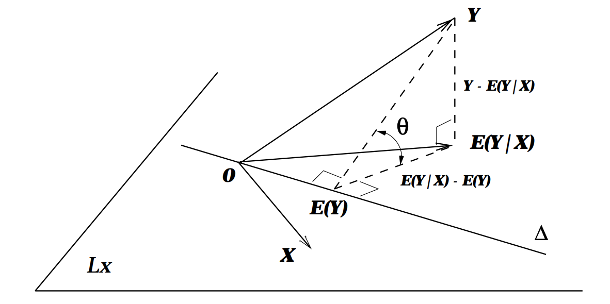
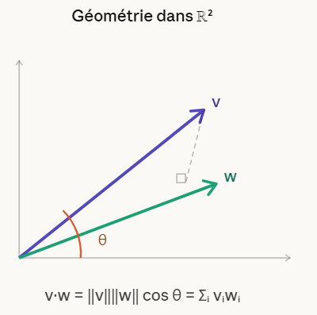

\---

title: Géométrie dans L²

date: 2026-03-21

tags: \[probabilités, géométrie, L2, hilbert]

\---

\## L'idée fondatrice

Un mathématicien s'est posé une question simple : \*et si les variables aléatoires se comportaient comme des vecteurs ?\*

En algèbre linéaire, un vecteur $v = (v\_1, \\dots, v\_n) \\in \\mathbb{R}^n$ a une norme naturelle :

$$\\|v\\| = \\sqrt{\\sum\_i v\_i^2}$$

Pour une variable aléatoire $X$, on cherche l'analogue. $X$ n'est pas un nombre fixe — c'est un résultat qui change à chaque tirage. Mais on peut quand même lui donner une "taille" :

$$\\|X\\|\_{L^2} = \\sqrt{E(X^2)} = \\sqrt{\\sum\_i p\_i x\_i^2}$$

Et de la même façon, le produit scalaire $\\langle v, w \\rangle = \\sum\_i v\_i w\_i$ devient :

$$\\langle X, Y \\rangle\_{L^2} = E(XY) = \\sum\_i p\_i \\, x\_i \\, y\_i$$

| Géométrie dans $\\mathbb{R}^n$ | Probabilités dans $L^2$ |

|---|---|

| Vecteur $v$ | Variable aléatoire $X$ |

| Composante $v\_i$ | Valeur $x\_i$ |

| Poids $1/n$ (uniforme) | Probabilité $p\_i$ |

| $\\langle v, w \\rangle = \\sum\_i v\_i w\_i$ | $\\langle X, Y \\rangle = E(XY)$ |

| $\\|v\\|^2 = \\sum\_i v\_i^2$ | $\\|X\\|^2 = E(X^2)$ |

| $\\cos \\theta = \\frac{\\langle v,w \\rangle}{\\|v\\|\\|w\\|}$ | $\\rho = \\frac{E(XY)}{\\|X\\|\\|Y\\|}$ |

\## L'espace $L^2$

On ne peut pas travailler avec \*toutes\* les variables aléatoires. Il faut imposer $E(X^2) < \\infty$. Pourquoi ? Parce que si $E(X^2)$ est infini, le produit scalaire $E(XY)$ peut exploser — et toute la géométrie s'effondre.

$L^2$ est donc l'espace des variables aléatoires \*raisonnables\* : celles pour lesquelles la géométrie tient.

Cet espace est un \*\*espace de Hilbert\*\* : il se comporte exactement comme $\\mathbb{R}^3$. On peut projeter, décomposer, appliquer Pythagore. Deux sous-espaces jouent un rôle central :

\- $\\Delta$ : la droite des \*\*variables constantes\*\*

\- $L^2\_X$ : le sous-espace des \*\*fonctions de $X$\*\*, i.e. $\\{\\varphi(X) \\mid \\varphi : \\mathbb{R} \\to \\mathbb{R}\\} \\cap L^2$

On a l'inclusion $\\Delta \\subset L^2\_X$ — toute constante est une fonction de $X$.

\## Trois applications immédiates

\### (i) L'espérance comme projection

$E(X)$ est la \*\*projection orthogonale de $X$ sur $\\Delta$\*\*. C'est la constante qui approche le mieux $X$ au sens $L^2$ :

$$E(X) = \\underset{a \\in \\Delta}{\\arg\\min} \\; E\\left\[(X - a)^2\\right]$$

\*Preuve.\* On développe $E\[(X-a)^2]$ :

$$E\[(X-a)^2] = E\[X^2] - 2a\\,E\[X] + a^2$$

En dérivant par rapport à $a$ et en annulant : $-2E\[X] + 2a = 0$, donc $a = E(X)$. $\\square$

La formule de König-Huyghens s'interprète comme le \*\*théorème de Pythagore\*\* appliqué au triangle rectangle $X$, $E(X)$, $a$ :

$$E\\left\[(X - a)^2\\right] = \\underbrace{V(X)}\_{\\|X - E(X)\\|^2} + \\underbrace{(E(X) - a)^2}\_{\\text{distance}^2}$$

\### (ii) La corrélation comme cosinus

En centrant les variables ($\\tilde{X} = X - E(X)$, $\\tilde{Y} = Y - E(Y)$) :

$$\\text{Cov}(X,Y) = \\langle \\tilde{X}, \\tilde{Y} \\rangle\_{L^2} \\qquad \\text{Var}(X) = \\|\\tilde{X}\\|^2\_{L^2}$$

Le coefficient de corrélation est le \*\*cosinus de l'angle\*\* entre $\\tilde{X}$ et $\\tilde{Y}$ dans $L^2$ :

$$\\rho(X,Y) = \\frac{\\langle \\tilde{X}, \\tilde{Y} \\rangle}{\\|\\tilde{X}\\| \\cdot \\|\\tilde{Y}\\|} = \\cos \\theta$$

Deux conséquences immédiates :

\- $X$ et $Y$ non corrélés $\\Longleftrightarrow$ $\\tilde{X} \\perp \\tilde{Y}$ dans $L^2$

\- $|\\rho| = 1$ $\\Longleftrightarrow$ $\\tilde{X}$ et $\\tilde{Y}$ colinéaires $\\Longleftrightarrow$ relation linéaire parfaite

L'inégalité de Cauchy-Schwarz $|\\langle \\tilde{X}, \\tilde{Y} \\rangle| \\leq \\|\\tilde{X}\\| \\cdot \\|\\tilde{Y}\\|$ garantit $|\\rho| \\leq 1$ — ce n'est pas un résultat mystérieux, c'est juste que $|\\cos \\theta| \\leq 1$.

\### (iii) L'espérance conditionnelle comme projection

$E(Y \\mid X)$ est la \*\*projection orthogonale de $Y$ sur $L^2\_X$\*\*. C'est la meilleure approximation de $Y$ par une fonction de $X$, au sens $L^2$ :

$$E(Y \\mid X) = \\underset{\\varphi(X) \\in L^2\_X}{\\arg\\min} \\; E\\left\[(Y - \\varphi(X))^2\\right]$$

Le résidu $Y - E(Y \\mid X)$ est orthogonal à $L^2\_X$ — il est non corrélé avec toute fonction de $X$.

Le \*\*théorème de la variance totale\*\* est le théorème de Pythagore appliqué au triangle $Y$, $E(Y)$, $E(Y \\mid X)$ :

$$\\underbrace{V(Y)}\_{\\|Y - E(Y)\\|^2} = \\underbrace{V(E(Y \\mid X))}\_{\\|E(Y|X) - E(Y)\\|^2} + \\underbrace{E\[V(Y \\mid X)]}\_{\\|Y - E(Y|X)\\|^2}$$

Le théorème de l'espérance totale $E(Y) = E(E(Y \\mid X))$ est un cas particulier du \*\*théorème des trois perpendiculaires\*\* : la projection de $Y$ sur $\\Delta$ passe par la projection de $Y$ sur $L^2\_X$.

